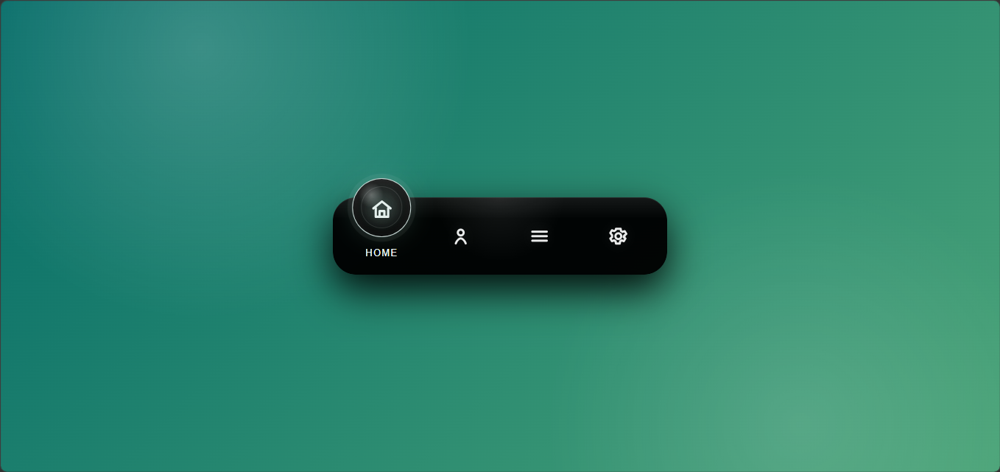

# 🌊 Awesome Floating Navigation Menu UI

A modern floating navigation menu with smooth animation and clean UI design.  
Built using HTML, CSS, and JavaScript to practice interactive front-end components.

---

## ✨ Features
- Floating navigation menu design
- Smooth animation effects
- Clean and modern UI
- Responsive layout (mobile & desktop)
- Easy to customize icons and menu items

---

## 🖥️ Preview

---

## ⚙️ Technologies Used
- HTML5
- CSS3 (Animations & Transitions)
- JavaScript (UI interaction control)
